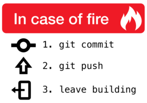

## Introduction

+ Research Software Engineer at University of Sheffield
+ Background Statistical Genetics, Medical Statistics and Data Scientist for Telematics Company
+ Blog Post (2022-10-10) : [pre-commit : Protecting your future self](https://rse.shef.ac.uk/blog/pre-commit/)


::: {.notes}
Good morning/afternoon, my name is Neil Shephard and I'm a Research Software Engineer at the University of
Sheffield. I've matured into this role after a convoluted career pathway via Statistical Genetics, Medical Statistics
during which I developed a keen interest in reproducible research and started using Git.

Prior to starting in my current role I spent a few years as a Data Scientist at a telematics company where I didn't
really do much data science but did learn Python, working collaboratively with Git and good practices for software
development and engineering.

I was invited here today by Alex Coleman, thank you Alex, on the back of a blog post I wrote pre-commit : Protecting
your Future Self and the QR code will take you to the blog post if you're quick enough to scan it before I move on.
:::

## Structure

+ (Very) brief Git version control.
+ A digression into Linting and Testing.
+ Git Hooks.
+ `pre-commit` installation.
+ `pre-commit` configuration.
+ `pre-commit` demo.
+ `pre-commit` in CI/CD.

::: {.notes}
In this talk I'll give a very brief overview of using Git for version control before making a digression into linting
and testing. We'll then look at Git Hooks because they underpin the functionality of pre-commit and I'll then go through
installing and configuring pre-commit, hopefully give a demonstration that won't fail and then show how pre-commit can
be integrated into Continuous Integration and Development pipelines.
:::

## Git

[](https://xkcd.com/1597/)

::: {.notes}
Ok, Git is pretty popular but could I have a show of hands for how many people are familiar with and use Git on a daily
basis please?

**Pause**

Great, looks like most of the audience are familiar with Git.
:::

## Git Workflow

<!-- https://mermaid.live/edit#pako:eNqlkjFrwzAQhf-KODBaTKg9amwLXbJ11XK2L7KIJQVZSinG_72SaAJpnFKoJvHufe8dSAv0biAQUFWLtjoItjA-ObWnM01cMD5QFxWvGQ8jGcpKhzNlQenw5vE0Jm3h8-g-nj3afqQ5CcFHqov44ozRYY9dicv6urK1qqS98NKydPriu793JZQdCEP01HwbRuqPLgZmUNsN_jL-QT2o2Ei7bW23Y9s_xv6yxX2zIa_oirCASjAJ56dds2sk_G-RBy3tTUt7bSkRUEMyJ3JIn2TJEwnlK0jIyID-mIE1-TAG9_5pexDl-SGeBgz0qlF5NCAOOM20fgEbjs0N -->
```{mermaid}
%%| fig-height: 2
%%{init: { 'logLevel': 'debug', 'theme': 'base', 'gitGraph': {'showBranches': true,'showCommitLabel': true, 'rotateCommitLabel': true}} }%%
gitGraph
    commit
    commit
    branch feature1
    checkout main
    commit
    checkout feature1
    commit
    commit
    checkout main
    branch feature2
    checkout feature2
    commit
    commit
    checkout feature1
    commit
    checkout main
    merge feature1 tag: "v0.1.1"
    checkout feature2
    commit
    commit
    checkout main
    merge feature2 tag: "v0.1.2"
    commit
```

::: {.notes}
A typical workflow of a version controlled directory is shown here

+ Make a branch from `main`.
+ Edit some files.
+ Stage and **commit** changes.
+ Push to remote `origin`.
+ Make a pull request.
+ Merge changes into `main` and if you're lucky you don't have any merge conflicts.

:::


## Linting and Testing

A digression...

+ Good practice to lint code & conform to Style Guides
+ Good practice to have tests in place for code.

::: {.notes}
We'll now take a short digression on good practices when writing code and look at linting and testing of code as these
are steps that pre-commit helps simplify.

When you write code it is sensible to write tests to ensure that your functions, methods and classes work as expected.

Similarly it is good practice to lint your code to ensure it conforms to style guides and remove any "smells".

:::


## A simple :snake: function

[`sample.py`](sample.py)

```{.python}
import numpy as np

from pathlib import Path

def find_files(file_path: Union[str, Path], file_ext: str) -> List:
    """Recursively find files of the stated type along the given file path."""
    # We have a really long comment on this line just for demonstration purposes so that we can generate a few errors that need linting
    try:
        return list(Path(file_path).rglob(f"**{file_ext}"))
    except:
        raise
```

::: {.notes}
This is a simple function in Python that we'll use to demonstrate linting and tests. You don't need to be too familiar
with Python to understand and follow along but a quick explanation is that a few libraries are imported, then the
function find_files is defined, it takes two arguments a file path and a file type and it will try to
recursively find all files ending with the given extension along that path, and if an exception is encountered it is raised.
:::


## Testing

[`test_sample.py`](test_sample.py)

```{.python}
from .sample import find_files

def test_find_files():
    """Test the find_files() function"""
    py_files = find_files(file_path="./", file_ext=".py")
    assert isinstance(py_files, list)
    assert "sample.py" is in py_files
```

::: {.notes}
This is a simple example of a test that you might write to check this file, it imports the function and uses it to look
in the current directory for files with the extension `.py` saving the results to `py_files`. The type of this is
checked to be a lit and the presence of `sample.py` in that list is checked.
:::


## Linting and Style Guides

Python has the [PEP8]() style guide which sets out a consistent way to write code, naming function, classes and methods.
Lots of tools for linting...

* [black](https://github.com/psf/black) PEP8 compliance.
* [flake8](https://flake8.pycqa.org/en/latest/) PEP8 compliance.
* [pylint](https://pylint.pycqa.org/en/latest/index.html) PEP8 compliance, code smells and refactoring suggestions.

::: {.notes}
:::


## Linting manually...

```{.bash}
black sample.py
flake8 sample.py
pylint sample.py
```

::: {.notes}
If you were running linting manually then you would have to invoke each and run them against a specific file, or all
files in a project directory. The later might actually cause some problems because if you are working on an existing
code based which hasn't been linted already these could potentially be changed (certainly black lints files in place
applying its opinionated style). When you then come to commit you may end up with the blame associated with code that
you only formatted rather than wrote. There are ways around this using Git's `--ignore-rev` flag to store commits in a
file `.git-blame-ignore-revs` that lists the hashes for which blame is to be ignored (see
[article](https://akrabat.com/ignoring-revisions-with-git-blame/))
:::

## Linting manually - `black`

```

```

::: {.notes}
:::

### Linting manually - `flake8`

```{.bash}
❱ flake8 sample.py
sample.py:1:1: D100 Missing docstring in public module
sample.py:1:1: F401 'numpy as np' imported but unused
sample.py:2:1: F401 'pandas as pd' imported but unused
sample.py:7:36: F821 undefined name 'Union'
sample.py:7:73: F821 undefined name 'List'
sample.py:8:80: E501 line too long (87 > 79 characters)
sample.py:9:80: E501 line too long (135 > 79 characters)
sample.py:12:5: E722 do not use bare 'except'
```

::: {.notes}
:::

### Linting manually - `pylint`

```{.bash}
❱ pylint sample.py
PYLINTHOME is now '/home/neil/.cache/pylint' but obsolescent '/home/neil/.pylint.d' is found; you can safely remove the latter
************* Module sample
sample.py:9:0: C0301: Line too long (135/120) (line-too-long)
sample.py:1:0: C0114: Missing module docstring (missing-module-docstring)
sample.py:7:35: E0602: Undefined variable 'Union' (undefined-variable)
sample.py:7:72: E0602: Undefined variable 'List' (undefined-variable)
sample.py:12:4: W0706: The except handler raises immediately (try-except-raise)
sample.py:4:0: C0411: standard import "from pathlib import Path" should be placed before "import numpy as np" (wrong-import-order)
sample.py:1:0: W0611: Unused numpy imported as np (unused-import)
sample.py:2:0: W0611: Unused pandas imported as pd (unused-import)

-------------------------------------
Your code has been rated at -10.00/10
```

::: {.notes}
:::

## ..._then_ you can commit and push



::: {.notes}
Git work cycles encourages regular saving of work, checking it into Git by making a commit. You only have to leave the
building if the fire-alarm is going off.
:::

<!-- ### Linting manually - `mypy` -->

<!-- ``` -->
<!-- ❱ mypy sample.py -->
<!-- /home/neil/.virtualenvs/python3_10/lib/python3.10/site-packages/numpy/__init__.pyi:636: error: Positional-only parameters are only supported in Python 3.8 and greater -->
<!-- Found 1 error in 1 file (errors prevented further checking) -->
<!-- ``` -->

<!-- ::: {.notes} -->
<!-- ::: -->

## Automate with [pre-commit](https://pre-commit.com)

* Uses Git Hooks to run checks automatically.
* Large number of


## What are Hooks?

* Actions that are run prior to or in response to a given action.

```{.bash code-line-numbers="9"}
 ls -lha .git/hooks
drwxr-xr-x neil neil 4.0 KB Mon Oct 24 10:26:37 2022  .
drwxr-xr-x neil neil 4.0 KB Tue Jan  3 18:48:37 2023  ..
.rwxr-xr-x neil neil 478 B  Sun Aug 14 13:35:27 2022  applypatch-msg.sample
.rwxr-xr-x neil neil 896 B  Sun Aug 14 13:35:27 2022  commit-msg.sample
.rwxr-xr-x neil neil 4.6 KB Sun Aug 14 13:35:27 2022  fsmonitor-watchman.sample
.rwxr-xr-x neil neil 189 B  Sun Aug 14 13:35:27 2022  post-update.sample
.rwxr-xr-x neil neil 424 B  Sun Aug 14 13:35:27 2022  pre-applypatch.sample
.rwxr-xr-x neil neil 1.6 KB Sun Aug 14 13:35:27 2022  pre-commit.sample
.rwxr-xr-x neil neil 416 B  Sun Aug 14 13:35:27 2022  pre-merge-commit.sample
.rwxr-xr-x neil neil 1.3 KB Sun Aug 14 13:35:27 2022  pre-push.sample
.rwxr-xr-x neil neil 4.8 KB Sun Aug 14 13:35:27 2022  pre-rebase.sample
.rwxr-xr-x neil neil 544 B  Sun Aug 14 13:35:27 2022  pre-receive.sample
.rwxr-xr-x neil neil 1.5 KB Sun Aug 14 13:35:27 2022  prepare-commit-msg.sample
.rwxr-xr-x neil neil 2.7 KB Sun Aug 14 13:35:27 2022  push-to-checkout.sample
.rwxr-xr-x neil neil 3.6 KB Sun Aug 14 13:35:27 2022  update.sample
```

::: {.notes}
Hooks are actions that are run prior to or in response to a given action.

A Git repository that has been initialised locally typically comes with a number of example scripts that run hooks in
response to different actions or steps in the git work cycle and these can be found under `.git/hooks/` if you've cloned
a repository then these `.git` directory generally isn't included so you won't have these.

As you can see from the directory listing there are a number of different stages at which hooks might apply, but as the
name of this talk gives away, the key hook of interest here is the `pre-commit` hook.

These are Bash scripts and you could sit down and craft your own script to undertake all the tasks you wish to run prior
to making commits. However
:::

## Testing

Tests ensure code works as expected.

**TODO** Write tests for above function.
```{.python}
```

### Testing - `pytest`

**TODO** Example of running tests.

```{.bash}
```
::: {.notes}
:::

## Linting with IDE

Popular IDEs have tools to run linting automatically on file save...

* Emacs : [blacken](https://github.com/pythonic-emacs/blacken) / [Flycheck](https://www.flycheck.org/en/latest/)
* VSCode : [Python](https://code.visualstudio.com/docs/python/linting) /
* PyCharm : [black](https://plugins.jetbrains.com/plugin/10563-black-pycharm) /
  [Mypy](https://plugins.jetbrains.com/plugin/11086-mypy) /
  [flake8](https://plugins.jetbrains.com/plugin/11563-flake8-support)
* RStudio : [lintr](https://lintr.r-lib.org/index.html)

::: {.notes}
Many popular Integrated Development Environments support linting of code on the fly or on saving files, Emacs has
`blacken` and `flycheck` modes, the later of which will run `flake8`.

VSCode has a Python module for linting.

PyCharm has plugins for `black`, `mypy` and `flake8`

RStudio has support for the `lintr` package (as does Emacs).

Using these tools is sensible as it can highlight quickly and early on problems with your code. Applying `black`
automatically also takes out some mental overhead in thinking about whether you are using the correct formatting whilst
writing code allowing you to focus on the problem you are trying to solve.
:::


## Committing

Ultimately you commit your changes then...

* Push to `origin`
* Open a Pull Request.
* See if test passes all CI tests.
* Await feedback and hopefully approval.

::: {.notes}
:::


## Problems

* Automated tests fail.
* Linting fails.


::: {.notes}
:::


## Pre-commit

*

::: {.notes}
This is where `pre-commit` comes to the rescue. Its a Python package that uses Git Hooks to run checks _before_ a commit
is made, hence the name! It can take care of running all the manual linting and tests for you and automate part of your
workflow.


Hooks are scripts that reside in `.git/hooks/`
:::
